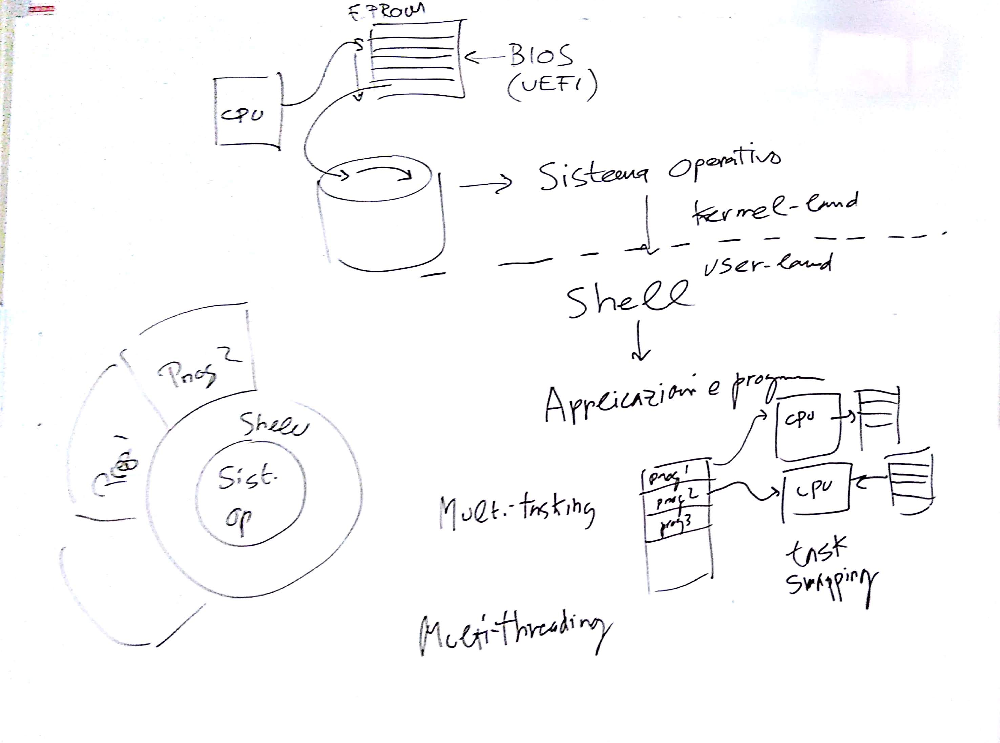

# EI - Lezione del 6 dicembre 2018

## Argomenti

* introduzione ai computers come strumenti professionali
* *hardware*:
  * schema globale
  * memoria RAM, ROM, EPROM
  * memoria di massa (dischi rigidi, SSD)
  * CPU
  * bus
  * I/O
* *software*:
  * `bios`
  * `kernel`
    * `mono-task`
    * `multi-task`
    * `threading`
    * *user-space* e *kernel-space*
  * `shell` e metafore di `shell`

## Lavagne

