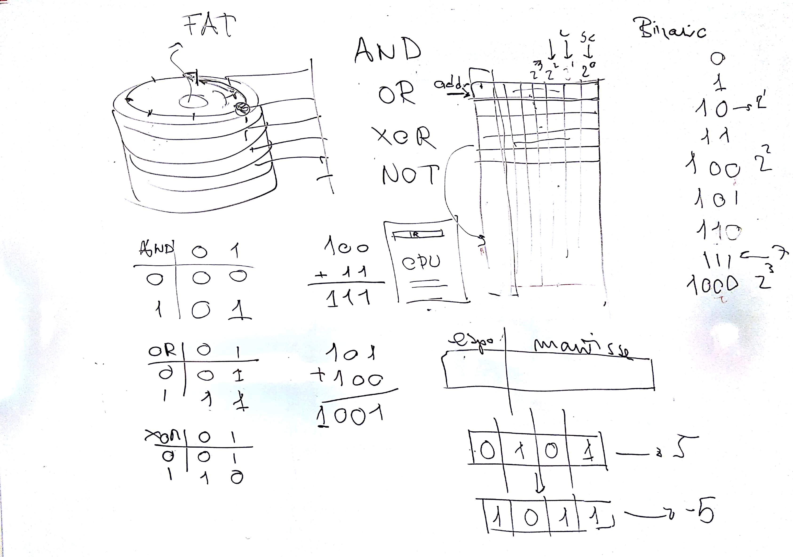

# EI - Lezione del 10 gennaio 2019

## Argomenti

* numerazione binaria
  * numeri interi
  * numeri decimali
* operazioni binarie
* logica booleana
* dimensioni numeriche
* demoltiplicazione delle dimensioni numeriche (esempio del disco, settori,
  ecc.)

## Lavagne

