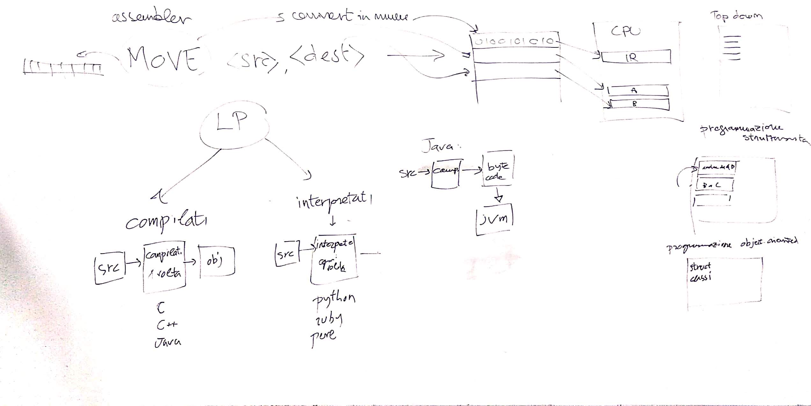

# EI - Lezione del 13 marzo 2019

## Argomenti

* Storia dei linguaggi di programmazione
* Linguaggi compilati e linguaggi interpretati
* Programmazione strutturata
* Programmazione orientata agli oggetti
* Esempi di scrittura (programma `ciao` scritto in vari linguaggi)

## Lavagne



## Esempi

### [`ciao!` in linguaggio `C`](./C/ciao.c)

```C
#include <stdio.h>

int main()
{
    printf("ciao!\n");

    return 0;
}
```

### [`ciao!` in linguaggio `java`](./java/Ciao.java)

```java
public class Ciao
{
  public static void main(String args[])
  {
     System.out.println("ciao!");
  }
}
```

### [`ciao!` in linguaggio `python`](./python/ciao.py)

```python
print "ciao!"
```

### [`ciao!` in linguaggio `ruby`](./ruby/ciao.rb)

```ruby
print "ciao!\n"
```

### [`ciao!` in linguaggio `perl`](./perl/ciao.pl)

```perl
print "ciao!\n"

```
