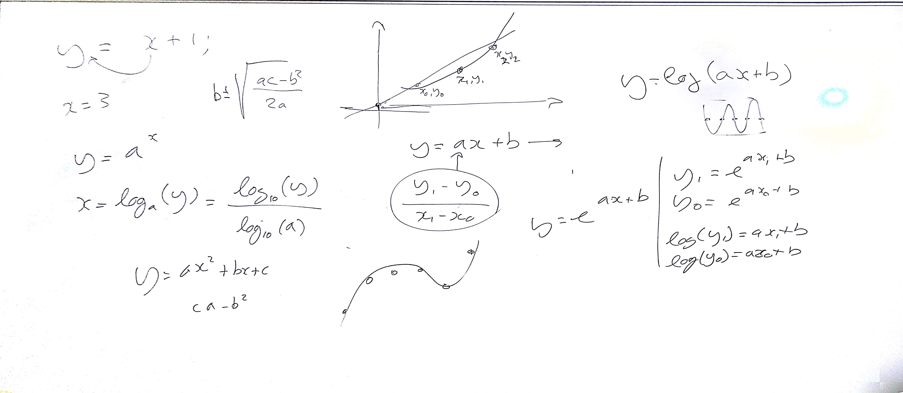
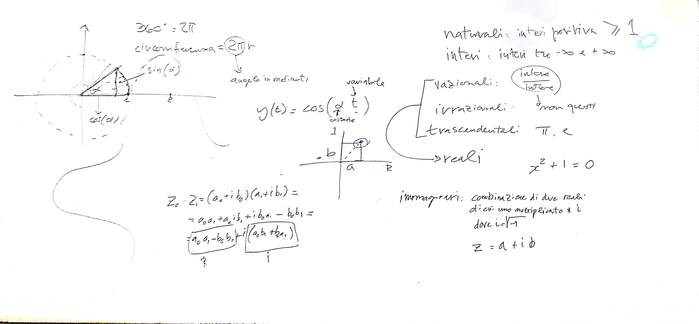

# EM - Lezione del 5 dicembre 2018

## Argomenti

* Strumentario: `octave`
* Verifica delle competenze pregresse
  * algebra
  * studio delle funzioni
* interpolazione lineare
* estensione dei domini numerici
  * naturali
  * interi
  * razionali
  * irrazionali
  * trascendentali
  * reali
  * complessi

## Lavagne

