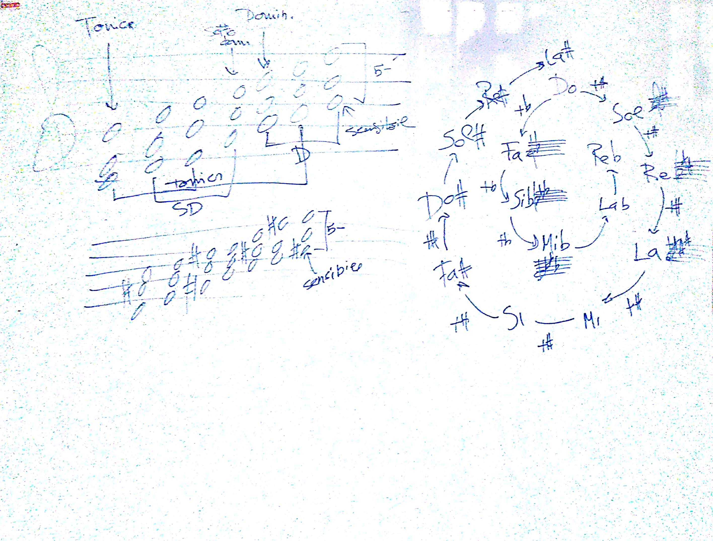

# TCMC - Lezione del 13 dicembre 2018

## Argomenti

* Ripasso dei fondamenti di armonia tonale
* dominanti secondarie, dominanti estese
* meccanismi estensivi
* [slides 18-28](./slides-20181213.pdf)

## Lavagne

