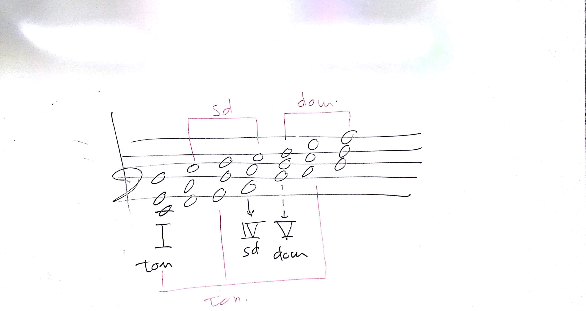

# TCMC - Lezione del 09 gennaio 2018

## Argomenti

* Ripasso dei fondamenti di armonia tonale
* dominanti secondarie, dominanti estese
* meccanismi estensivi
* relazioni cromatiche delle medianti
* progressioni non funzionali
* politonalità
* [slides 19-36](./TCMC_19-36.pdf)

## Lavagne

